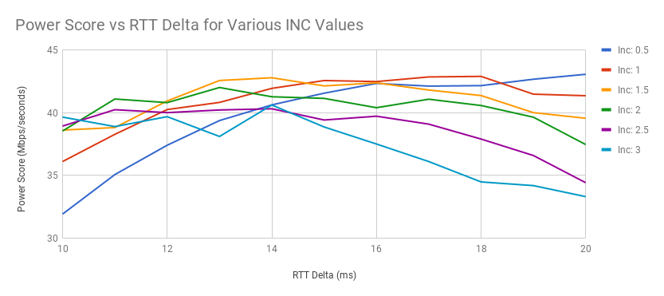

# Programming Assignment 1: Congestion Control Contest
## Hudson Ayers, Paul Crews | CS 244

## Git Repository

The git repository containing our submission can be found at 
[https://github.com/ptcrews/sourdough.git](https://github.com/ptcrews/sourdough.git)

The commit hash containing code for individual exercises are listed in this
report in the section describing each exercise. We do not provide a commit
hash for exercise C because exercise C was removed as a requirement.

## Final Statistics:

Average throughput: 3.94 Mbits/s

95th percentile signal delay: 91 ms

Power Score: 43.30

## Overview

This document presents the work we did to complete each of the exercises
presented in Programming Assignment 1. The section describing Exercise D
contains information about our approach and decision making, as well as plots
detailing many of the different runs we attempted.

## Exercise A: Window Size

**Commit Hash:** addc858857466f569a7751fed125ea55faf2b25b

For this exercise, we wrote scripts to conduct two different tests. First,
we wrote a script that edited the controller.cc file to return different window
sizes from the window_size() function. This script tested 20 different window sizes
ranging from 10 packets to 200 packets. The results of our test can be seen in the
plot above. It is clear from the plot that increasing the window size improves throughput
at the expense of delay, and that for window sizes above 50 packets there was
little gain in throughput but significant expense in delay.

Next, we wrote a script that ran the test for a single fixed window
size of 50 packets 20 times. The averages and standard deviation of each of the
output measurements can be seen in the table below. As can be seen in the table,
the variation between measurements is pretty small.

## Exercise B: AIMD Scheme
**Commit Hash:** b6c5d7ab0d889e48a91eab0f4cfa6066459ff597

Our simple AIMD scheme increased the window size by 1 every time a full window
size of acks was received. Additionally, our scheme halved the window size whenever
a drop was detected via a repeated ACK or a timeout. Our timeout was set as a
constant of 1 second. This scheme did not work particularly well - in fact, it
was even worse than the best of the fixed window measurments when compared by 
Power Score. AIMD ensured high throughput but resulted in very large delays. Specifically,
implementing AIMD with the constants described above resulted in the following 
measurements:

Average throughput: 4.85 Mbits/s (96.2% utilization)

95th percentile per-packet queueing delay: 1094 ms

95th percentile signal delay: 1713 ms

Power Score: 2.83

## Exercise C: Delay-Triggered Scheme

For this exercise, we modified controller.cc such that the window size would
be reduced whenever an ack was received with a delay greater than UPPER\_THRESH,
and would be increased whenever an ack was received with a delay less than
LOWER\_THRESH. We found that increasing and decreasing the window size by 1 for
each ack resulted in too rapid of changes, so we changed the window size variable
to be a double (which we would cast to an integer before returning it to sender.cc)
and instead incremented the variable by 0.1 per ack received when the ack delay fell
within one of the specified ranges. We tried several values for UPPER\_THRESH and 
LOWER\_THRESH, such as 900ms/300ms, which gave a power score of 3.545, and 
600ms/200ms, which gave a power score of 4.92. Upon recognizing that this method still
sometimes resulted in window sizes that were either too large or too small, we bounded
the possible window size which could result using LOWER\_BOUND and UPPER\_BOUND 
constants. After fiddling with different values for all four of these constants, we
settled on UPPER\_THRESH = 400ms, LOWER\_THRESH = 150ms, UPPER\_BOUND = 125 packets,
and LOWER\_BOUND = 30 packets. This resulted in a throughout of 4.73 Mbits/s, a signal
delay of 518 ms, and a power score of 9.13.

## Exercise D: The Contest

Our contest submission can be run by calling make, then ./run\_contest, from the
master branch of our git repository.

### Initial Approach
Our initial approach built on the code from Exercise C, while combining some
insights from the BBR paper. In particular, our approach assumed that the
network path was not changing significantly, and that the minimum 
measured RTT latency over the 2 minute interval
is at least as large as the true RTT latency. As a consequence, our first
design kept track of the minimum RTT value observed, and adjusted the window size based on
the difference between the measured RTT of each received acknowledgement and the minimum RTT.
Specifically, we set a constant rtt\_delta in controller.hh, and for our initial
approach we would increase the window size if the measured RTT was less than 
minRTT + rtt\_delta, and would decrease the window size by 0.1 every time an 
ack was received such that the measured RTT was more then minRTT + rtt\_delta.
This approach was highly effective, and
significantly improved latency while keeping throughput reasonable.

### Additional Improvements

- **Multiple Window Size Adjustments:**
Our next thought in this process was that applying a constant adjustment to the
window size regardless of how far the measured RTT was from the minRTT + 
rtt\_delta boundary was not ideal behavior - when near the boundary, less 
adjustment was needed than when further from the boundary. To account for this,
we reduced the adjustment made when near the boundary, and increased the window
size adjustment when far from the boundary, by mapping 4 ranges of delay to 4 different
window size adjustments. This helped some, but we had some difficulty determining where 
exactly to place the cutoffs for these ranges, and how different the window size
adjustments should be. Our best attempts for this approach came when increasing
the window size by 0.3 for measurements that were 2\*rtt\_delta greater than
the minRTT, 0.1 for measurements only 1 rtt\_delta greater than the minRTT, and 
decreasing by 0.1 only when measurments were 0.5\*rtt\_delta less than minRTT + 
rtt\_delta.

- **Quadratic Window Size Adjustments**
After playing with constants as described in the previous section, we decided
that a better approach would be a system for which the window size adjustment was
directly tied to how far off the measured RTT is from minRTT + rtt\_delta. Upon
further reflection, we decided that we wanted this setup so that when the window
size was near minRTT + rtt\_delta, we wanted to change the window size very little,
but when far from this point, we wanted to change the window size rapidly. 
Accordingly, we implemented a quadratic function to adjust the window size based
off of how far the measured RTT of each ack is from minRTT + rtt\_delta. 
These quadratic functions were then multiplied by INC\_CONST and DEC\_CONST
multipliers (for increasing the window size and decreasing the window size, 
respectively) which we tuned to ensure that the adjustment of window size in either
direction was neither too fast nor too slow.

- **Improved Estimation of Ideal Window Size**
After looking at the network traces, we noticed that the window size would
remain small for extended periods of time even though latency had dropped
back to a reasonable value. We attribute this to the fact that our
implementation did not attempt to measure the "true" bandwidth of the network.
After experimenting with several approaches, we decided to estimate the
current bandwidth by using an exponentially-weighted moving average, then
when under "good" network conditions (that is, when the measured RTT is close
to the true RTT) we rapidly expand the window to match the expanded size.
Similarly, if the window is over-extended and we start to see increases in the
measured RTT, we quickly cut the window size to be either equal to or less
than the estimated window size. This significantly improved throughput while
slightly increasing the measured latency.

- **Agressive Timeouts:**
Up until this point we were still only triggering timeouts if acks
were received more than a seconds after they were sent. Given the availability
of RTT estimates, we changed the timeout length to be any time a packet took
longer than 2\*minRTT to be acked. This proactive handling of timeouts 
improved our power score by reducing signal delay due to dropped packets.

- **Optimizing Constants:**
After adding most of the major functionality to our project, we started to
focus on improving the power score of our algorithm by optimizing constants.
Most of these constants are found in controller.hh, and we ran numerous tests
that changed these values to maximize the power score. The majority of these
tests were run on a GCE instance to improve reliability, and the final
constants we selected were based on the output from these tests. Note that
this optimization runs the highest risk for overtraining our algorithm on
the dataset, but we believe that this optimization did not substantively
decrease the performance of our algorithm in general. In total, we optmized
the following constants:
  - SEQ\_TIMEOUT: This is the separation between sequential timeouts before
reducing the window size again (in ms).
  - Alpha: This is the update coefficient for the exponentially weighted moving
average used to estimate the bandwidth.
  - DEC: This is the multiplier for decreasing the size of the window when
we receive a bad RTT.
  - INC: This is the multiplier for increasing the window size when we receive
a good RTT.
  - TIMEOUT: This is the size of the timeout (in multiples of RTT).
  - RTT\_Delta: This is the allowed delta around the minRTT that catagorizes
a "good" or "bad" RTT.

Figure 3 is the output from one of our experiments, where we varied both the INC
and RTT\_Delta parameters (where the INC value is the weight we give each
window size adjustment, and the RTT\_Delta is the permitted deviance from the
true RTT).

### Overtraining Resistance
One of our main concerns with our algorithm is overtraining to this specific
dataset. In particular, our extensive testing to find the best constants for
various parameters ran the risk of overfitting our algorithm to only be
performant with this specific network trace. However, we are confident that
our algorithm will perform well in general for three main reasons:

1. *The selected constants fall within a good range.* Our test suite ran on
a range of values, all of which gave good performance in general. Our selection
of constants was well within this range, indicating that we were simply picking
the best value from a set of good values. We believe that it is unlikely that
our constant optimization significantly negatively impacts the performance
of our algorithm on other datasets.

2. *Our assumptions are general.* Although our algorithm makes some assumptions
about the data, these assumptions are either general enough to not overfit
this dataset, or also hold for the dataset we will be tested against. For
instance, we made the assumption that the true RTT of the network link does
not significantly change over the course of the test. Since we know that the
dataset we will be tested against has the same propogation delay (20ms,
according to the TAs on Piazza), we know this assumption does not overfit our
data to this specific test.

3. *Our performance was not terrible on other traces.* We ran our test suite
on other network traces, and our performance did not appear to be terrible.
Although we certainly performed worse in comparison to the provided dataset,
we seemed to perform about as optimal as possible with our given approach.

### Unsuccessful Efforts

- **Time Based Window Size Restoration:**
One idea that we had was to estimate the ideal congestion window to which 
we should return upon noticing that congestion has fallen. To do so, we
saved a moving window of past window sizes. Upon receiving an ack with a 
long RTT, indicating the prescence of significant congestion, we would store
whatever window size was used for the window previous to the window which resulted
congestion. Once, in the future, we detected that congestion had dissapeared (by
detecting an RTT near the minRTT again) we would rapidly ramp up the window size
by setting it to this saved pre-congestion window size. The idea is that this would
earn back some of the wasted throughput. Unfortunately, this approach ended up
harming delay too much to make it worthwhile, as at time we would ramp back up too
rapidly, as the bandwidth available was not as high as prior to the congestion instance.
Accordingly, we removed this code from our final implementation.

## Exercise E: Name

After extensive deliberation, we decided to call our algorithm "TensorFlowRateFairness",
even though our approach did not use machine learning at all. This is because it makes our
algorithm appear significantly more intimidating and complex than it is.

